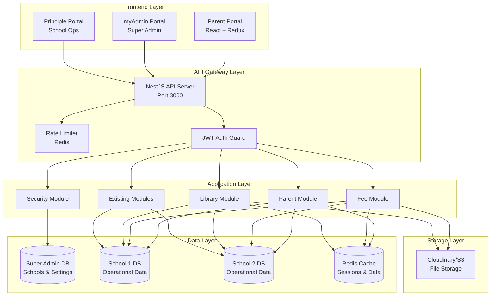
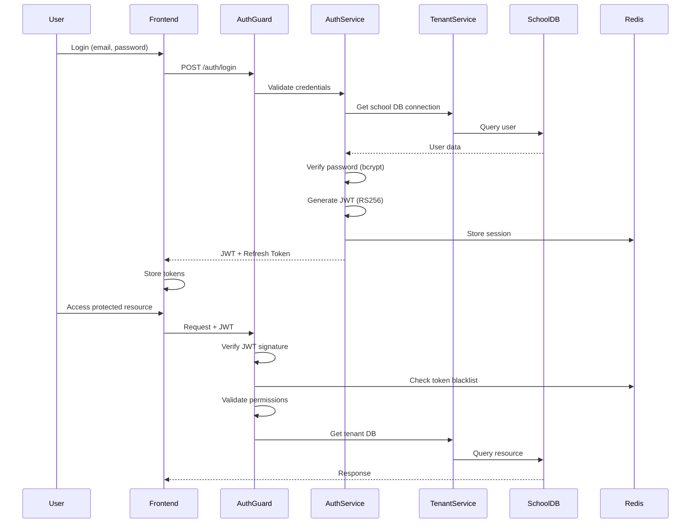
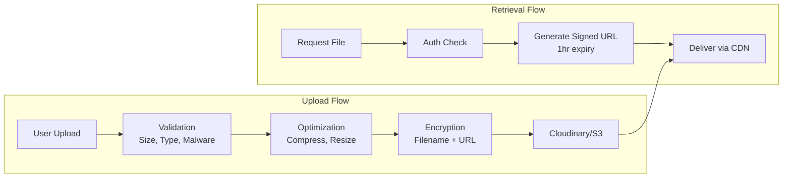

# Design Document: School Management System Enhancements

## Overview

This design document specifies the technical architecture and implementation details for enhancing the existing School Management System with four major feature sets:

1. **Multi-Child Parent Account System**: Enables parents to manage multiple children through a single account
2. **Manual Fee Management System**: Comprehensive fee structure configuration, payment submission, and approval workflow
3. **Library Management System**: Complete book catalog, issue/return tracking, fines, and reservations
4. **Security & Optimization**: Enhanced RBAC, encryption, caching, rate limiting, and performance optimizations

### System Context

The existing system consists of:
- **Backend**: NestJS + TypeORM + PostgreSQL with multi-tenant architecture
- **Frontend Apps**: 
  - myAdmin (Super Admin portal - React + Redux)
  - Principle (School operations portal - React + Redux)
  - Parent Portal (New - to be created)
- **Existing Modules**: Students, Teachers, Staff, Classes, Announcements, Schedules, Attendance
- **Multi-Tenancy**: Separate database per school with TenantConnectionService managing connections
- **Authentication**: JWT-based with role-based access control

### Design Goals

- Seamless integration with existing modules and architecture patterns
- Maintain data isolation between schools using existing tenant connection service
- Implement comprehensive security measures including encryption and RBAC
- Optimize performance through caching, indexing, and query optimization
- Provide intuitive user interfaces for all user roles
- Ensure backward compatibility with existing functionality


## Architecture

### High-Level System Architecture



### Database Architecture


**Two-Tier Database Structure**:

1. **Super Admin Database**: Global configuration and school registry
   - Schools table (existing)
   - Super admin users (existing)
   - Global settings (existing)

2. **School-Specific Databases**: Isolated operational data per school
   - All student, teacher, staff data
   - Parent accounts and relationships
   - Fee structures and payment records
   - Library catalog and transactions
   - Attendance, schedules, announcements

**Multi-Tenancy Implementation**:
- Leverage existing `TenantConnectionService` for dynamic database connections
- School identifier in JWT token determines target database
- Connection pooling and caching per tenant
- Complete data isolation between schools

### Authentication and Authorization Flow




### File Storage Architecture



**Storage Strategy**:
- **Payment Proofs**: JPEG/PNG/PDF, max 5MB, stored with encrypted URLs
- **Book Covers**: JPEG/PNG, max 2MB, optimized to WebP, multiple sizes (thumbnail, medium, original)
- **CDN Integration**: Cloudinary for image optimization and delivery
- **Security**: Signed URLs with 1-hour expiration, malware scanning on upload

### Caching Layer (Redis)

**Cache Strategy**:
- **Session Data**: 24-hour TTL, stores JWT refresh tokens and user sessions
- **Dashboard Statistics**: 5-minute TTL, aggregated counts and summaries
- **Fee Structures**: 1-hour TTL, class-wise fee configurations
- **Book Catalog**: 30-minute TTL, frequently accessed book data
- **Rate Limiting Counters**: 1-minute sliding window
- **Cache Invalidation**: Automatic on data modification

**Cache Key Namespacing**:
```
school:{schoolId}:user:{userId}:session
school:{schoolId}:dashboard:stats
school:{schoolId}:fees:structure:{classId}
school:{schoolId}:library:book:{bookId}
ratelimit:{userId}:{endpoint}
```


## Components and Interfaces

### Backend Module Structure

Following existing NestJS patterns, new modules will be organized as:

```
school backend/src/modules/
├── parents/
│   ├── parents.module.ts
│   ├── parents.controller.ts
│   ├── parents.service.ts
│   ├── entities/
│   │   ├── parent.entity.ts
│   │   └── parent-student.entity.ts
│   ├── dto/
│   │   ├── create-parent.dto.ts
│   │   ├── update-parent.dto.ts
│   │   ├── link-student.dto.ts
│   │   └── parent-response.dto.ts
│   └── guards/
│       └── parent-access.guard.ts
│
├── fees/
│   ├── fees.module.ts
│   ├── fees.controller.ts
│   ├── fees.service.ts
│   ├── entities/
│   │   ├── fee-structure.entity.ts
│   │   ├── fee-record.entity.ts
│   │   ├── payment-submission.entity.ts
│   │   └── fee-receipt.entity.ts
│   ├── dto/
│   │   ├── create-fee-structure.dto.ts
│   │   ├── assign-fee.dto.ts
│   │   ├── submit-payment.dto.ts
│   │   ├── approve-payment.dto.ts
│   │   └── fee-report.dto.ts
│   └── services/
│       ├── fee-calculation.service.ts
│       ├── receipt-generation.service.ts
│       └── payment-reminder.service.ts
│
├── library/
│   ├── library.module.ts
│   ├── library.controller.ts
│   ├── library.service.ts
│   ├── entities/
│   │   ├── book.entity.ts
│   │   ├── book-issue.entity.ts
│   │   ├── book-return.entity.ts
│   │   ├── fine.entity.ts
│   │   └── reservation.entity.ts
│   ├── dto/
│   │   ├── create-book.dto.ts
│   │   ├── issue-book.dto.ts
│   │   ├── return-book.dto.ts
│   │   ├── book-search.dto.ts
│   │   └── library-report.dto.ts
│   └── services/
│       ├── book-catalog.service.ts
│       ├── issue-return.service.ts
│       ├── fine-calculation.service.ts
│       └── reservation.service.ts
│
└── security/
    ├── security.module.ts
    ├── guards/
    │   ├── jwt-auth.guard.ts
    │   ├── roles.guard.ts
    │   ├── rate-limit.guard.ts
    │   └── school-isolation.guard.ts
    ├── decorators/
    │   ├── roles.decorator.ts
    │   ├── current-user.decorator.ts
    │   └── school-id.decorator.ts
    ├── services/
    │   ├── encryption.service.ts
    │   ├── audit-log.service.ts
    │   └── token.service.ts
    └── entities/
        └── audit-log.entity.ts
```


### Frontend Module Structure

**New Parent Portal Application**:

```
ParentPortal/
├── src/
│   ├── components/
│   │   ├── ui/ (shared with myAdmin/Principle)
│   │   ├── layout/
│   │   │   ├── ParentDashboardLayout.tsx
│   │   │   ├── ParentHeader.tsx
│   │   │   └── ParentSidebar.tsx
│   │   ├── children/
│   │   │   ├── ChildCard.tsx
│   │   │   ├── ChildSelector.tsx
│   │   │   └── ChildDetails.tsx
│   │   ├── fees/
│   │   │   ├── FeeCard.tsx
│   │   │   ├── PaymentUpload.tsx
│   │   │   ├── PaymentHistory.tsx
│   │   │   └── ReceiptDownload.tsx
│   │   └── library/
│   │       ├── LibraryCard.tsx
│   │       ├── BorrowingHistory.tsx
│   │       └── FinesList.tsx
│   ├── pages/
│   │   ├── Login.tsx
│   │   ├── Dashboard.tsx
│   │   ├── ChildDetails.tsx
│   │   ├── Fees.tsx
│   │   ├── Library.tsx
│   │   └── Profile.tsx
│   ├── store/
│   │   ├── api/
│   │   │   ├── parentApi.ts
│   │   │   ├── feeApi.ts
│   │   │   └── libraryApi.ts
│   │   └── slices/
│   │       ├── parentSlice.ts
│   │       └── childrenSlice.ts
│   └── types/
│       ├── parent.ts
│       ├── fee.ts
│       └── library.ts
```

**Enhancements to Existing Portals**:

- **myAdmin**: No changes required (Super Admin doesn't manage parents directly)
- **Principle Portal**: Add parent management, fee management, and library management sections

```
Principle/src/
├── pages/
│   ├── parents/
│   │   ├── ParentsList.tsx
│   │   ├── CreateParent.tsx
│   │   └── LinkStudents.tsx
│   ├── fees/
│   │   ├── FeeStructures.tsx
│   │   ├── FeeAssignment.tsx
│   │   ├── PaymentApprovals.tsx
│   │   └── FeeReports.tsx
│   └── library/
│       ├── BookCatalog.tsx
│       ├── IssueReturn.tsx
│       ├── Fines.tsx
│       └── LibraryReports.tsx
```


### API Endpoints Design

**Parent Management APIs**:

```typescript
// Parent CRUD
POST   /api/parents                    // Create parent account
GET    /api/parents                    // List all parents (Principal/Staff)
GET    /api/parents/:id                // Get parent details
PATCH  /api/parents/:id                // Update parent
DELETE /api/parents/:id                // Delete parent

// Parent-Student Relationships
POST   /api/parents/:id/students       // Link student to parent
DELETE /api/parents/:id/students/:studentId  // Unlink student
GET    /api/parents/:id/students       // Get linked students

// Parent Authentication
POST   /api/auth/parent/login          // Parent login
POST   /api/auth/parent/refresh        // Refresh token
POST   /api/auth/parent/logout         // Logout

// Parent Dashboard
GET    /api/parent/dashboard           // Parent dashboard data
GET    /api/parent/children            // List my children
GET    /api/parent/children/:id/attendance  // Child attendance
GET    /api/parent/children/:id/announcements  // Child announcements
GET    /api/parent/children/:id/schedule      // Child schedule
```

**Fee Management APIs**:

```typescript
// Fee Structures
POST   /api/fees/structures            // Create fee structure
GET    /api/fees/structures            // List fee structures
GET    /api/fees/structures/:id        // Get fee structure
PATCH  /api/fees/structures/:id        // Update fee structure
DELETE /api/fees/structures/:id        // Delete fee structure

// Fee Assignment
POST   /api/fees/assign                // Assign fee to student(s)
POST   /api/fees/assign/bulk           // Bulk assign to class
GET    /api/fees/records               // List fee records
GET    /api/fees/records/:id           // Get fee record details

// Payment Submission (Parent)
POST   /api/fees/payments/submit       // Submit payment proof
GET    /api/fees/payments/my           // My payment submissions
GET    /api/fees/payments/:id          // Get payment details

// Payment Approval (Principal/Staff)
GET    /api/fees/payments/pending      // List pending payments
PATCH  /api/fees/payments/:id/approve  // Approve payment
PATCH  /api/fees/payments/:id/reject   // Reject payment

// Receipts
GET    /api/fees/receipts/:id          // Download receipt
POST   /api/fees/receipts/:id/regenerate  // Regenerate receipt

// Reports
GET    /api/fees/reports/collection    // Collection report
GET    /api/fees/reports/defaulters    // Defaulters list
GET    /api/fees/reports/class-wise    // Class-wise breakdown
```


**Library Management APIs**:

```typescript
// Book Catalog
POST   /api/library/books              // Add book
GET    /api/library/books              // List/search books
GET    /api/library/books/:id          // Get book details
PATCH  /api/library/books/:id          // Update book
DELETE /api/library/books/:id          // Archive book
POST   /api/library/books/import       // Bulk import via CSV

// Book Issue/Return
POST   /api/library/issues             // Issue book to student
GET    /api/library/issues             // List active issues
GET    /api/library/issues/:id         // Get issue details
PATCH  /api/library/issues/:id/extend  // Extend due date
POST   /api/library/returns            // Process book return

// Fines
GET    /api/library/fines              // List fines
GET    /api/library/fines/student/:id  // Student fines
PATCH  /api/library/fines/:id/pay      // Mark fine as paid
PATCH  /api/library/fines/:id/waive    // Waive fine

// Reservations
POST   /api/library/reservations       // Reserve book
GET    /api/library/reservations/my    // My reservations
DELETE /api/library/reservations/:id   // Cancel reservation

// Student Library Card
GET    /api/library/card               // My library card
GET    /api/library/card/history       // Borrowing history
GET    /api/library/card/current       // Current issues

// Reports
GET    /api/library/reports/usage      // Library usage stats
GET    /api/library/reports/popular    // Most borrowed books
GET    /api/library/reports/overdue    // Overdue books list
```


### Request/Response Schemas

**Common Response Structure**:

```typescript
interface ApiResponse<T> {
  success: boolean;
  data?: T;
  error?: {
    code: string;
    message: string;
    details?: any;
  };
  meta?: {
    page?: number;
    pageSize?: number;
    totalPages?: number;
    totalRecords?: number;
  };
}
```

**Pagination Query Parameters**:

```typescript
interface PaginationQuery {
  page?: number;        // Default: 1
  pageSize?: number;    // Default: 20, Max: 100
  sortBy?: string;      // Field to sort by
  sortOrder?: 'ASC' | 'DESC';  // Default: DESC
}
```

**Authentication Headers**:

```typescript
// All authenticated requests
Authorization: Bearer <JWT_TOKEN>

// School-specific requests (automatically extracted from JWT)
X-School-Id: <school_id>
```

**Error Response Format**:

```typescript
// 400 Bad Request
{
  "success": false,
  "error": {
    "code": "VALIDATION_ERROR",
    "message": "Invalid input data",
    "details": {
      "email": "Invalid email format",
      "phone": "Phone number must be 10 digits"
    }
  }
}

// 401 Unauthorized
{
  "success": false,
  "error": {
    "code": "UNAUTHORIZED",
    "message": "Invalid or expired token"
  }
}

// 403 Forbidden
{
  "success": false,
  "error": {
    "code": "FORBIDDEN",
    "message": "Insufficient permissions"
  }
}

// 429 Too Many Requests
{
  "success": false,
  "error": {
    "code": "RATE_LIMIT_EXCEEDED",
    "message": "Too many requests, please try again later"
  },
  "retryAfter": 60
}
```


## Data Models

### Parent Management Entities

**Parent Entity**:

```typescript
@Entity('parents')
export class Parent {
  @PrimaryGeneratedColumn('uuid')
  id: string;

  @Column()
  name: string;

  @Column({ unique: true })
  @Transform(({ value }) => EncryptionService.encrypt(value))
  email: string;

  @Column()
  @Transform(({ value }) => EncryptionService.encrypt(value))
  phone: string;

  @Column()
  password: string;  // bcrypt hashed

  @Column({ default: 'active' })
  status: 'active' | 'inactive';

  @OneToMany(() => ParentStudent, ps => ps.parent)
  parentStudents: ParentStudent[];

  @CreateDateColumn({ type: 'timestamptz' })
  createdAt: Date;

  @UpdateDateColumn({ type: 'timestamptz' })
  updatedAt: Date;

  // Indexes
  @Index()
  email: string;

  @Index()
  phone: string;
}
```

**Parent-Student Relationship Entity**:

```typescript
@Entity('parent_students')
export class ParentStudent {
  @PrimaryGeneratedColumn('uuid')
  id: string;

  @Column()
  @Index()
  parentId: string;

  @Column()
  @Index()
  studentId: string;

  @ManyToOne(() => Parent, parent => parent.parentStudents)
  @JoinColumn({ name: 'parentId' })
  parent: Parent;

  @ManyToOne(() => Student)
  @JoinColumn({ name: 'studentId' })
  student: Student;

  @Column({ default: 'active' })
  status: 'active' | 'inactive';

  @CreateDateColumn({ type: 'timestamptz' })
  linkedAt: Date;

  // Composite unique constraint
  @Unique(['parentId', 'studentId'])
}
```


### Fee Management Entities

**Fee Structure Entity**:

```typescript
@Entity('fee_structures')
export class FeeStructure {
  @PrimaryGeneratedColumn('uuid')
  id: string;

  @Column()
  name: string;

  @Column()
  @Index()
  classId: string;

  @Column({ type: 'jsonb' })
  feeTypes: {
    type: 'Tuition' | 'Transport' | 'Library' | 'Sports' | 'Exam' | 'Custom';
    amount: number;
    currency: string;
    description: string;
    mandatory: boolean;
  }[];

  @Column()
  frequency: 'Monthly' | 'Quarterly' | 'Yearly';

  @Column({ type: 'jsonb', nullable: true })
  lateFee: {
    type: 'percentage' | 'fixed';
    value: number;
  };

  @Column({ type: 'jsonb', nullable: true })
  discount: {
    type: 'percentage' | 'fixed';
    value: number;
  };

  @Column({ type: 'jsonb', nullable: true })
  installments: {
    count: number;
    schedule: { installmentNumber: number; dueDate: Date; amount: number }[];
  };

  @Column({ default: 'active' })
  status: 'active' | 'inactive';

  @CreateDateColumn({ type: 'timestamptz' })
  createdAt: Date;

  @UpdateDateColumn({ type: 'timestamptz' })
  updatedAt: Date;
}
```

**Fee Record Entity**:

```typescript
@Entity('fee_records')
export class FeeRecord {
  @PrimaryGeneratedColumn('uuid')
  id: string;

  @Column()
  @Index()
  studentId: string;

  @Column()
  @Index()
  feeStructureId: string;

  @Column({ type: 'decimal', precision: 10, scale: 2 })
  totalAmount: number;

  @Column({ type: 'decimal', precision: 10, scale: 2, default: 0 })
  paidAmount: number;

  @Column({ type: 'decimal', precision: 10, scale: 2, default: 0 })
  discountAmount: number;

  @Column({ type: 'date' })
  dueDate: Date;

  @Column({ default: 'pending' })
  @Index()
  status: 'pending' | 'partial' | 'paid' | 'overdue';

  @ManyToOne(() => Student)
  @JoinColumn({ name: 'studentId' })
  student: Student;

  @ManyToOne(() => FeeStructure)
  @JoinColumn({ name: 'feeStructureId' })
  feeStructure: FeeStructure;

  @CreateDateColumn({ type: 'timestamptz' })
  createdAt: Date;

  @UpdateDateColumn({ type: 'timestamptz' })
  updatedAt: Date;
}
```


**Payment Submission Entity**:

```typescript
@Entity('payment_submissions')
export class PaymentSubmission {
  @PrimaryGeneratedColumn('uuid')
  id: string;

  @Column()
  @Index()
  feeRecordId: string;

  @Column()
  @Index()
  parentId: string;

  @Column()
  @Transform(({ value }) => EncryptionService.encrypt(value))
  paymentProofUrl: string;

  @Column({ type: 'decimal', precision: 10, scale: 2 })
  amount: number;

  @Column({ type: 'decimal', precision: 10, scale: 2, default: 0 })
  lateFeeAmount: number;

  @Column({ nullable: true })
  transactionReference: string;

  @Column({ type: 'text', nullable: true })
  remarks: string;

  @Column({ default: 'pending' })
  @Index()
  status: 'pending' | 'approved' | 'rejected';

  @Column({ type: 'text', nullable: true })
  rejectionReason: string;

  @Column({ nullable: true })
  approvedBy: string;

  @Column({ type: 'timestamptz', nullable: true })
  approvedAt: Date;

  @Column({ nullable: true })
  receiptUrl: string;

  @ManyToOne(() => FeeRecord)
  @JoinColumn({ name: 'feeRecordId' })
  feeRecord: FeeRecord;

  @ManyToOne(() => Parent)
  @JoinColumn({ name: 'parentId' })
  parent: Parent;

  @CreateDateColumn({ type: 'timestamptz' })
  submittedAt: Date;

  @UpdateDateColumn({ type: 'timestamptz' })
  updatedAt: Date;
}
```

**Fee Receipt Entity**:

```typescript
@Entity('fee_receipts')
export class FeeReceipt {
  @PrimaryGeneratedColumn('uuid')
  id: string;

  @Column({ unique: true })
  receiptNumber: string;

  @Column()
  @Index()
  paymentSubmissionId: string;

  @Column()
  studentId: string;

  @Column({ type: 'jsonb' })
  receiptData: {
    studentName: string;
    className: string;
    feeBreakdown: { type: string; amount: number }[];
    totalAmount: number;
    lateFee: number;
    paymentDate: Date;
    approvedBy: string;
    schoolDetails: any;
  };

  @Column()
  pdfUrl: string;

  @ManyToOne(() => PaymentSubmission)
  @JoinColumn({ name: 'paymentSubmissionId' })
  paymentSubmission: PaymentSubmission;

  @CreateDateColumn({ type: 'timestamptz' })
  generatedAt: Date;
}
```


### Library Management Entities

**Book Entity**:

```typescript
@Entity('books')
export class Book {
  @PrimaryGeneratedColumn('uuid')
  id: string;

  @Column({ unique: true })
  @Index()
  isbn: string;

  @Column()
  @Index()
  title: string;

  @Column()
  @Index()
  author: string;

  @Column()
  publisher: string;

  @Column()
  @Index()
  category: 'Fiction' | 'Non-Fiction' | 'Science' | 'Mathematics' | 
            'History' | 'Literature' | 'Reference' | 'Custom';

  @Column({ type: 'int' })
  publicationYear: number;

  @Column({ type: 'int' })
  totalQuantity: number;

  @Column({ type: 'int' })
  availableQuantity: number;

  @Column({ nullable: true })
  coverImageUrl: string;

  @Column({ type: 'text', nullable: true })
  description: string;

  @Column({ default: 'active' })
  status: 'active' | 'archived';

  @CreateDateColumn({ type: 'timestamptz' })
  createdAt: Date;

  @UpdateDateColumn({ type: 'timestamptz' })
  updatedAt: Date;

  // Check constraint
  @Check('availableQuantity >= 0')
  @Check('availableQuantity <= totalQuantity')
}
```

**Book Issue Entity**:

```typescript
@Entity('book_issues')
export class BookIssue {
  @PrimaryGeneratedColumn('uuid')
  id: string;

  @Column({ unique: true })
  issueId: string;

  @Column()
  @Index()
  bookId: string;

  @Column()
  @Index()
  studentId: string;

  @Column()
  issuedBy: string;  // Library staff ID

  @Column({ type: 'date' })
  issueDate: Date;

  @Column({ type: 'date' })
  @Index()
  dueDate: Date;

  @Column({ default: 'active' })
  @Index()
  status: 'active' | 'returned' | 'overdue';

  @ManyToOne(() => Book)
  @JoinColumn({ name: 'bookId' })
  book: Book;

  @ManyToOne(() => Student)
  @JoinColumn({ name: 'studentId' })
  student: Student;

  @CreateDateColumn({ type: 'timestamptz' })
  createdAt: Date;

  @UpdateDateColumn({ type: 'timestamptz' })
  updatedAt: Date;
}
```


**Book Return Entity**:

```typescript
@Entity('book_returns')
export class BookReturn {
  @PrimaryGeneratedColumn('uuid')
  id: string;

  @Column()
  @Index()
  bookIssueId: string;

  @Column({ type: 'date' })
  returnDate: Date;

  @Column()
  returnedTo: string;  // Library staff ID

  @Column()
  condition: 'Good' | 'Fair' | 'Damaged' | 'Lost';

  @Column({ type: 'decimal', precision: 10, scale: 2, default: 0 })
  lateFine: number;

  @Column({ type: 'decimal', precision: 10, scale: 2, default: 0 })
  damageFine: number;

  @Column({ type: 'text', nullable: true })
  notes: string;

  @ManyToOne(() => BookIssue)
  @JoinColumn({ name: 'bookIssueId' })
  bookIssue: BookIssue;

  @CreateDateColumn({ type: 'timestamptz' })
  createdAt: Date;
}
```

**Fine Entity**:

```typescript
@Entity('fines')
export class Fine {
  @PrimaryGeneratedColumn('uuid')
  id: string;

  @Column()
  @Index()
  studentId: string;

  @Column({ nullable: true })
  bookReturnId: string;

  @Column({ type: 'decimal', precision: 10, scale: 2 })
  amount: number;

  @Column()
  reason: 'late_return' | 'damage' | 'lost_book';

  @Column({ default: 'pending' })
  @Index()
  status: 'pending' | 'paid' | 'waived';

  @Column({ nullable: true })
  paidBy: string;

  @Column({ type: 'timestamptz', nullable: true })
  paidAt: Date;

  @Column({ nullable: true })
  waivedBy: string;

  @Column({ type: 'text', nullable: true })
  waiverReason: string;

  @ManyToOne(() => Student)
  @JoinColumn({ name: 'studentId' })
  student: Student;

  @ManyToOne(() => BookReturn, { nullable: true })
  @JoinColumn({ name: 'bookReturnId' })
  bookReturn: BookReturn;

  @CreateDateColumn({ type: 'timestamptz' })
  createdAt: Date;

  @UpdateDateColumn({ type: 'timestamptz' })
  updatedAt: Date;
}
```


**Reservation Entity**:

```typescript
@Entity('reservations')
export class Reservation {
  @PrimaryGeneratedColumn('uuid')
  id: string;

  @Column()
  @Index()
  bookId: string;

  @Column()
  @Index()
  studentId: string;

  @Column({ type: 'int' })
  queuePosition: number;

  @Column({ default: 'active' })
  @Index()
  status: 'active' | 'notified' | 'fulfilled' | 'expired' | 'cancelled';

  @Column({ type: 'timestamptz', nullable: true })
  notifiedAt: Date;

  @Column({ type: 'timestamptz', nullable: true })
  expiresAt: Date;

  @ManyToOne(() => Book)
  @JoinColumn({ name: 'bookId' })
  book: Book;

  @ManyToOne(() => Student)
  @JoinColumn({ name: 'studentId' })
  student: Student;

  @CreateDateColumn({ type: 'timestamptz' })
  createdAt: Date;

  @UpdateDateColumn({ type: 'timestamptz' })
  updatedAt: Date;
}
```

### Security Entities

**Audit Log Entity**:

```typescript
@Entity('audit_logs')
export class AuditLog {
  @PrimaryGeneratedColumn('uuid')
  id: string;

  @Column()
  @Index()
  userId: string;

  @Column()
  userRole: string;

  @Column()
  @Index()
  action: string;

  @Column()
  @Index()
  resourceType: string;

  @Column({ nullable: true })
  resourceId: string;

  @Column({ type: 'jsonb', nullable: true })
  metadata: any;

  @Column()
  ipAddress: string;

  @Column({ nullable: true })
  userAgent: string;

  @Column()
  @Index()
  result: 'success' | 'failure';

  @Column({ type: 'text', nullable: true })
  errorMessage: string;

  @CreateDateColumn({ type: 'timestamptz' })
  @Index()
  timestamp: Date;

  // Prevent modification
  @BeforeUpdate()
  preventUpdate() {
    throw new Error('Audit logs cannot be modified');
  }
}
```


### Database Indexes Strategy

**Critical Indexes for Performance**:

```sql
-- Parent Management
CREATE INDEX idx_parents_email ON parents(email);
CREATE INDEX idx_parents_phone ON parents(phone);
CREATE INDEX idx_parent_students_parent ON parent_students(parentId);
CREATE INDEX idx_parent_students_student ON parent_students(studentId);
CREATE UNIQUE INDEX idx_parent_students_unique ON parent_students(parentId, studentId);

-- Fee Management
CREATE INDEX idx_fee_structures_class ON fee_structures(classId);
CREATE INDEX idx_fee_records_student ON fee_records(studentId);
CREATE INDEX idx_fee_records_status ON fee_records(status);
CREATE INDEX idx_fee_records_due_date ON fee_records(dueDate);
CREATE INDEX idx_payment_submissions_fee_record ON payment_submissions(feeRecordId);
CREATE INDEX idx_payment_submissions_parent ON payment_submissions(parentId);
CREATE INDEX idx_payment_submissions_status ON payment_submissions(status);

-- Library Management
CREATE INDEX idx_books_isbn ON books(isbn);
CREATE INDEX idx_books_title ON books(title);
CREATE INDEX idx_books_author ON books(author);
CREATE INDEX idx_books_category ON books(category);
CREATE INDEX idx_book_issues_book ON book_issues(bookId);
CREATE INDEX idx_book_issues_student ON book_issues(studentId);
CREATE INDEX idx_book_issues_status ON book_issues(status);
CREATE INDEX idx_book_issues_due_date ON book_issues(dueDate);
CREATE INDEX idx_fines_student ON fines(studentId);
CREATE INDEX idx_fines_status ON fines(status);
CREATE INDEX idx_reservations_book ON reservations(bookId);
CREATE INDEX idx_reservations_student ON reservations(studentId);
CREATE INDEX idx_reservations_status ON reservations(status);

-- Audit Logs
CREATE INDEX idx_audit_logs_user ON audit_logs(userId);
CREATE INDEX idx_audit_logs_action ON audit_logs(action);
CREATE INDEX idx_audit_logs_resource ON audit_logs(resourceType);
CREATE INDEX idx_audit_logs_timestamp ON audit_logs(timestamp);
CREATE INDEX idx_audit_logs_result ON audit_logs(result);
```

### Foreign Key Constraints

```sql
-- Parent-Student relationships
ALTER TABLE parent_students 
  ADD CONSTRAINT fk_parent_students_parent 
  FOREIGN KEY (parentId) REFERENCES parents(id) ON DELETE CASCADE;

ALTER TABLE parent_students 
  ADD CONSTRAINT fk_parent_students_student 
  FOREIGN KEY (studentId) REFERENCES students(id) ON DELETE CASCADE;

-- Fee relationships
ALTER TABLE fee_records 
  ADD CONSTRAINT fk_fee_records_student 
  FOREIGN KEY (studentId) REFERENCES students(id) ON DELETE RESTRICT;

ALTER TABLE fee_records 
  ADD CONSTRAINT fk_fee_records_structure 
  FOREIGN KEY (feeStructureId) REFERENCES fee_structures(id) ON DELETE RESTRICT;

ALTER TABLE payment_submissions 
  ADD CONSTRAINT fk_payment_submissions_fee_record 
  FOREIGN KEY (feeRecordId) REFERENCES fee_records(id) ON DELETE RESTRICT;

-- Library relationships
ALTER TABLE book_issues 
  ADD CONSTRAINT fk_book_issues_book 
  FOREIGN KEY (bookId) REFERENCES books(id) ON DELETE RESTRICT;

ALTER TABLE book_issues 
  ADD CONSTRAINT fk_book_issues_student 
  FOREIGN KEY (studentId) REFERENCES students(id) ON DELETE RESTRICT;

ALTER TABLE book_returns 
  ADD CONSTRAINT fk_book_returns_issue 
  FOREIGN KEY (bookIssueId) REFERENCES book_issues(id) ON DELETE RESTRICT;

ALTER TABLE fines 
  ADD CONSTRAINT fk_fines_student 
  FOREIGN KEY (studentId) REFERENCES students(id) ON DELETE RESTRICT;
```


## Correctness Properties

*A property is a characteristic or behavior that should hold true across all valid executions of a system—essentially, a formal statement about what the system should do. Properties serve as the bridge between human-readable specifications and machine-verifiable correctness guarantees.*

### Property 1: Parent Account Creation Completeness

*For any* valid parent data (name, email, phone, password), creating a parent account should result in a record with all fields populated and a unique identifier generated.

**Validates: Requirements 1.1, 1.2**

### Property 2: Parent-Student Linking Cardinality

*For any* parent account, the system should allow linking any number of students (0 to N), and the count of linked students should equal the count of parent-student relationship records.

**Validates: Requirements 1.3, 1.4**

### Property 3: Unlinking Preserves Records

*For any* parent-student link, unlinking should remove the relationship but preserve both the parent and student records in the database.

**Validates: Requirements 1.5, 1.7**

### Property 4: Email Uniqueness Constraint

*For any* existing parent email, attempting to create another parent account with the same email should fail with a validation error.

**Validates: Requirements 1.6**

### Property 5: Encryption Round-Trip

*For any* parent phone number or email, decrypt(encrypt(data)) should equal the original data.

**Validates: Requirements 1.8, 22.1, 22.2**

### Property 6: Input Format Validation

*For any* invalid email format or phone format, attempting to create a parent account should fail with appropriate validation errors.

**Validates: Requirements 1.9, 1.10, 25.1, 25.2**

### Property 7: Authentication Token Contents

*For any* successful parent authentication, the generated JWT token should contain the parent role and the correct parent identifier.

**Validates: Requirements 2.1, 2.2**

### Property 8: Authentication Error Uniformity

*For any* failed authentication attempt (wrong email or wrong password), the error message should be identical to prevent information leakage.

**Validates: Requirements 2.3**

### Property 9: Rate Limiting Enforcement

*For any* email address, the 6th login attempt within 15 minutes should be blocked with HTTP 429 status.

**Validates: Requirements 2.4, 24.1, 24.3**

### Property 10: Token Refresh Validity

*For any* valid JWT token before expiration, refreshing should produce a new valid token with updated expiration.

**Validates: Requirements 2.6**

### Property 11: Parent Data Access Authorization

*For any* parent user, accessing student data should succeed only for linked students and return 403 for non-linked students.

**Validates: Requirements 2.7, 2.8, 3.4**

### Property 12: Audit Logging Completeness

*For any* authentication attempt, an audit log entry should be created with timestamp, user identifier, IP address, and result.

**Validates: Requirements 2.9**


### Property 13: Dashboard Children List Completeness

*For any* parent with N linked children, the dashboard response should contain exactly N children with name, class, section, and roll number for each.

**Validates: Requirements 3.1, 3.2, 3.6**

### Property 14: Dashboard Count Consistency

*For any* parent dashboard response, the summary count should equal the length of the children array.

**Validates: Requirements 3.7**

### Property 15: Dashboard Caching Behavior

*For any* parent dashboard request, repeated requests within 5 minutes should return cached data without querying the database.

**Validates: Requirements 3.10**

### Property 16: Fee Structure Creation Validation

*For any* fee structure with zero fee types, creation should fail with a validation error.

**Validates: Requirements 6.8**

### Property 17: Fee Structure Deletion Protection

*For any* fee structure with associated fee records, deletion should fail to maintain referential integrity.

**Validates: Requirements 6.10**

### Property 18: Fee Assignment Creates Record

*For any* student and fee structure, assigning the fee should create a fee record linking both with the correct due date and total amount.

**Validates: Requirements 7.1, 7.3**

### Property 19: Duplicate Fee Assignment Prevention

*For any* student and fee period, attempting to assign the same fee twice should fail with a validation error.

**Validates: Requirements 7.7**

### Property 20: Bulk Fee Assignment Atomicity

*For any* bulk fee assignment operation, if any single assignment fails, all assignments in that batch should be rolled back.

**Validates: Requirements 7.9**

### Property 21: Payment File Upload Validation

*For any* file upload, files exceeding 5MB or with types other than JPEG/PNG/PDF should be rejected with appropriate errors.

**Validates: Requirements 8.3, 8.4**

### Property 22: Payment Submission Initial State

*For any* new payment proof upload, the created payment submission should have status "Pending".

**Validates: Requirements 8.6**

### Property 23: Approved Payment Immutability

*For any* payment submission with status "Approved", attempting to upload new payment proof or modify the submission should fail.

**Validates: Requirements 8.10, 9.10**

### Property 24: Late Fee Calculation

*For any* payment submission after the due date, the system should calculate and add late fees to the total amount.

**Validates: Requirements 8.11, 8.12**

### Property 25: Payment Approval State Transition

*For any* pending payment submission, approving should update the submission status to "Approved" and mark the associated fee record as paid.

**Validates: Requirements 9.5**

### Property 26: Receipt Generation Uniqueness

*For any* set of generated receipts, all receipt numbers should be unique across the system.

**Validates: Requirements 10.1**

### Property 27: Receipt URL Storage

*For any* approved payment, the generated receipt URL should be stored in the payment submission record and be retrievable.

**Validates: Requirements 10.5**

### Property 28: ISBN Validation and Uniqueness

*For any* book creation, invalid ISBN formats (not 10 or 13 digits) should be rejected, and duplicate ISBNs should fail with uniqueness error.

**Validates: Requirements 13.2, 13.6**

### Property 29: Book Issue Availability Check

*For any* book with available quantity of 0, attempting to issue the book should fail with an availability error.

**Validates: Requirements 15.2**

### Property 30: Book Issue Quantity Decrement

*For any* successful book issue, the book's available quantity should decrease by exactly 1.

**Validates: Requirements 15.5**

### Property 31: Student Borrowing Limit

*For any* student with 3 active book issues, attempting to issue a 4th book should fail with a borrowing limit error.

**Validates: Requirements 15.6, 15.7**


### Property 32: Book Return Quantity Increment

*For any* successful book return, the book's available quantity should increase by exactly 1.

**Validates: Requirements 16.4**

### Property 33: Late Return Fine Calculation

*For any* book returned after the due date, the system should calculate fine as (days overdue × 5 currency units).

**Validates: Requirements 16.5, 16.6**

### Property 34: Book Reservation Creation

*For any* unavailable book, a student should be able to create a reservation, and the reservation record should exist with correct student and book IDs.

**Validates: Requirements 18.2**

### Property 35: Student Reservation Limit

*For any* student with 2 active reservations, attempting to create a 3rd reservation should fail with a limit error.

**Validates: Requirements 18.3**

### Property 36: Permission-Based Access Control

*For any* protected resource and user without required permissions, access should be denied with HTTP 403 status.

**Validates: Requirements 21.3**

### Property 37: Cross-School Data Isolation

*For any* authenticated user, attempting to access data from a different school should fail with authorization error.

**Validates: Requirements 31.5**

### Property 38: Pagination Constraint Enforcement

*For any* list endpoint request with page size parameter, the response should never contain more than 100 records.

**Validates: Requirements 28.4, 32.1**

### Property 39: Pagination Metadata Completeness

*For any* paginated response, the metadata should include total records, total pages, current page, and page size.

**Validates: Requirements 32.5**

### Property 40: Referential Integrity Validation

*For any* operation requiring a parent-student relationship, the operation should fail if the relationship doesn't exist in the database.

**Validates: Requirements 38.2**

### Property 41: Positive Amount Validation

*For any* fee amount or fine amount, negative values should be rejected with validation error.

**Validates: Requirements 38.4**

### Property 42: Date Order Validation

*For any* book issue, if the issue date is after the due date, creation should fail with validation error.

**Validates: Requirements 38.5**

### Property 43: Book Quantity Invariant

*For any* book in the catalog, (total quantity - available quantity) should always equal the count of active book issues for that book.

**Validates: Requirement invariant from requirements document**

### Property 44: Fee Balance Invariant

*For any* fee record, (total amount - sum of approved payments) should equal the pending balance.

**Validates: Requirement invariant from requirements document**


## Error Handling

### Error Categories and HTTP Status Codes

**Validation Errors (400 Bad Request)**:
- Invalid input format (email, phone, ISBN)
- Missing required fields
- Data type mismatches
- Constraint violations (negative amounts, invalid date ranges)

**Authentication Errors (401 Unauthorized)**:
- Invalid credentials
- Expired JWT token
- Missing authentication token
- Token signature verification failure

**Authorization Errors (403 Forbidden)**:
- Insufficient permissions for action
- Cross-school data access attempt
- Parent accessing non-linked student data
- Attempting to modify immutable records

**Not Found Errors (404 Not Found)**:
- Resource does not exist
- Invalid resource ID

**Conflict Errors (409 Conflict)**:
- Duplicate email/ISBN
- Duplicate fee assignment
- Concurrent modification conflicts

**Rate Limit Errors (429 Too Many Requests)**:
- Exceeded login attempt limit
- Exceeded API request rate limit

**Server Errors (500 Internal Server Error)**:
- Database connection failures
- Unhandled exceptions
- External service failures

### Error Response Structure

All errors follow consistent format:

```typescript
{
  "success": false,
  "error": {
    "code": "ERROR_CODE",
    "message": "User-friendly error message",
    "details": {
      // Field-specific errors for validation
    }
  },
  "timestamp": "2024-01-15T10:30:00Z",
  "path": "/api/endpoint",
  "correlationId": "uuid"
}
```

### Error Handling Strategy

**Global Exception Filter**:
```typescript
@Catch()
export class GlobalExceptionFilter implements ExceptionFilter {
  catch(exception: unknown, host: ArgumentsHost) {
    // Log error with correlation ID
    // Sanitize error message
    // Return appropriate HTTP status
    // Never expose stack traces in production
  }
}
```

**Retry Logic**:
- Transient database errors: 3 retries with exponential backoff
- External service calls: Circuit breaker pattern
- File upload failures: Retry once after 2 seconds

**Logging**:
- All errors logged with severity level
- Critical errors trigger alerts
- Correlation IDs for request tracing
- Sensitive data excluded from logs


## Testing Strategy

### Dual Testing Approach

The system requires both unit testing and property-based testing for comprehensive coverage:

**Unit Tests**: Verify specific examples, edge cases, and error conditions
- Specific authentication scenarios
- Edge cases (zero children, empty book catalog)
- Integration points between modules
- Error handling paths

**Property-Based Tests**: Verify universal properties across all inputs
- Use **fast-check** library for TypeScript/JavaScript
- Minimum 100 iterations per property test
- Each test references its design document property
- Comprehensive input coverage through randomization

### Property-Based Testing Configuration

**Library Selection**: fast-check (TypeScript/JavaScript PBT library)

**Test Structure**:
```typescript
import fc from 'fast-check';

describe('Feature: school-management-enhancements, Property 1: Parent Account Creation Completeness', () => {
  it('should create parent with all fields for any valid input', () => {
    fc.assert(
      fc.property(
        fc.record({
          name: fc.string({ minLength: 1, maxLength: 100 }),
          email: fc.emailAddress(),
          phone: fc.string({ minLength: 10, maxLength: 15 }),
          password: fc.string({ minLength: 8 })
        }),
        async (parentData) => {
          const result = await parentService.create(parentData);
          expect(result.id).toBeDefined();
          expect(result.name).toBe(parentData.name);
          expect(result.email).toBeDefined();
          expect(result.phone).toBeDefined();
        }
      ),
      { numRuns: 100 }
    );
  });
});
```

**Tag Format**: Each property test must include a comment:
```typescript
// Feature: school-management-enhancements, Property 5: Encryption Round-Trip
```

### Unit Testing Strategy

**Focus Areas**:
- Specific examples demonstrating correct behavior
- Edge cases: empty lists, zero quantities, boundary values
- Error conditions: invalid inputs, unauthorized access
- Integration between modules: parent-student linking, fee-payment workflow

**Test Organization**:
```
tests/
├── unit/
│   ├── parents/
│   │   ├── parent.service.spec.ts
│   │   ├── parent.controller.spec.ts
│   │   └── parent-access.guard.spec.ts
│   ├── fees/
│   │   ├── fee.service.spec.ts
│   │   ├── fee-calculation.service.spec.ts
│   │   └── payment-approval.spec.ts
│   └── library/
│       ├── book.service.spec.ts
│       ├── issue-return.service.spec.ts
│       └── fine-calculation.service.spec.ts
├── property/
│   ├── parent-properties.spec.ts
│   ├── fee-properties.spec.ts
│   ├── library-properties.spec.ts
│   └── security-properties.spec.ts
├── integration/
│   ├── parent-student-workflow.spec.ts
│   ├── fee-payment-workflow.spec.ts
│   └── library-workflow.spec.ts
└── e2e/
    ├── parent-portal.e2e.spec.ts
    ├── fee-management.e2e.spec.ts
    └── library-management.e2e.spec.ts
```

### Test Coverage Requirements

- Minimum 80% code coverage for unit tests
- All 44 correctness properties implemented as property-based tests
- Integration tests for critical workflows
- E2E tests for user journeys

### Testing Tools

- **Jest**: Test runner and assertion library
- **fast-check**: Property-based testing
- **Supertest**: API endpoint testing
- **TypeORM**: In-memory database for testing
- **Playwright**: E2E testing for frontend


## Security Implementation

### Encryption Strategy

**Data at Rest**:
- Parent email and phone: AES-256-GCM encryption
- Payment proof URLs: AES-256-GCM encryption
- Encryption keys stored in environment variables
- Key rotation every 90 days

**Encryption Service**:
```typescript
@Injectable()
export class EncryptionService {
  private algorithm = 'aes-256-gcm';
  private key: Buffer;
  
  constructor(private configService: ConfigService) {
    this.key = Buffer.from(
      this.configService.get('ENCRYPTION_KEY'),
      'hex'
    );
  }
  
  encrypt(text: string): string {
    const iv = crypto.randomBytes(16);
    const cipher = crypto.createCipheriv(this.algorithm, this.key, iv);
    let encrypted = cipher.update(text, 'utf8', 'hex');
    encrypted += cipher.final('hex');
    const authTag = cipher.getAuthTag();
    return `${iv.toString('hex')}:${authTag.toString('hex')}:${encrypted}`;
  }
  
  decrypt(encryptedText: string): string {
    const [ivHex, authTagHex, encrypted] = encryptedText.split(':');
    const iv = Buffer.from(ivHex, 'hex');
    const authTag = Buffer.from(authTagHex, 'hex');
    const decipher = crypto.createDecipheriv(this.algorithm, this.key, iv);
    decipher.setAuthTag(authTag);
    let decrypted = decipher.update(encrypted, 'hex', 'utf8');
    decrypted += decipher.final('utf8');
    return decrypted;
  }
}
```

**Data in Transit**:
- HTTPS/TLS 1.3 for all API communications
- Certificate pinning for mobile apps
- Secure WebSocket connections for real-time features

### JWT Token Structure

**Token Payload**:
```typescript
interface JWTPayload {
  sub: string;           // User ID
  email: string;
  role: 'super_admin' | 'principal' | 'teacher' | 'staff' | 'library_staff' | 'student' | 'parent';
  schoolId: string;      // For school-specific users
  permissions: string[]; // Granular permissions
  iat: number;          // Issued at
  exp: number;          // Expires at
}
```

**Token Generation**:
```typescript
@Injectable()
export class TokenService {
  generateAccessToken(user: User): string {
    const payload: JWTPayload = {
      sub: user.id,
      email: user.email,
      role: user.role,
      schoolId: user.schoolId,
      permissions: this.getPermissions(user.role),
      iat: Math.floor(Date.now() / 1000),
      exp: Math.floor(Date.now() / 1000) + (24 * 60 * 60) // 24 hours
    };
    
    return jwt.sign(payload, this.privateKey, { algorithm: 'RS256' });
  }
  
  generateRefreshToken(userId: string): string {
    const token = crypto.randomBytes(32).toString('hex');
    // Store in database with expiration
    return token;
  }
}
```

### RBAC Implementation

**Role Definitions**:
```typescript
enum Role {
  SUPER_ADMIN = 'super_admin',
  PRINCIPAL = 'principal',
  TEACHER = 'teacher',
  STAFF = 'staff',
  LIBRARY_STAFF = 'library_staff',
  STUDENT = 'student',
  PARENT = 'parent'
}

enum Permission {
  // Parent Management
  PARENT_CREATE = 'parent:create',
  PARENT_READ = 'parent:read',
  PARENT_UPDATE = 'parent:update',
  PARENT_DELETE = 'parent:delete',
  PARENT_LINK_STUDENT = 'parent:link_student',
  
  // Fee Management
  FEE_STRUCTURE_CREATE = 'fee_structure:create',
  FEE_ASSIGN = 'fee:assign',
  PAYMENT_APPROVE = 'payment:approve',
  PAYMENT_SUBMIT = 'payment:submit',
  FEE_REPORT_VIEW = 'fee_report:view',
  
  // Library Management
  BOOK_CREATE = 'book:create',
  BOOK_ISSUE = 'book:issue',
  BOOK_RETURN = 'book:return',
  FINE_MANAGE = 'fine:manage',
  FINE_WAIVE = 'fine:waive',
  
  // Student Data Access
  STUDENT_DATA_VIEW = 'student_data:view',
  STUDENT_DATA_OWN = 'student_data:own' // For parents
}
```

**Permission Matrix**:
```typescript
const ROLE_PERMISSIONS: Record<Role, Permission[]> = {
  [Role.SUPER_ADMIN]: Object.values(Permission),
  [Role.PRINCIPAL]: [
    Permission.PARENT_CREATE,
    Permission.PARENT_READ,
    Permission.PARENT_UPDATE,
    Permission.PARENT_LINK_STUDENT,
    Permission.FEE_STRUCTURE_CREATE,
    Permission.FEE_ASSIGN,
    Permission.PAYMENT_APPROVE,
    Permission.FEE_REPORT_VIEW,
    Permission.BOOK_CREATE,
    Permission.FINE_WAIVE,
    Permission.STUDENT_DATA_VIEW
  ],
  [Role.STAFF]: [
    Permission.PARENT_READ,
    Permission.FEE_ASSIGN,
    Permission.PAYMENT_APPROVE,
    Permission.STUDENT_DATA_VIEW
  ],
  [Role.LIBRARY_STAFF]: [
    Permission.BOOK_CREATE,
    Permission.BOOK_ISSUE,
    Permission.BOOK_RETURN,
    Permission.FINE_MANAGE
  ],
  [Role.PARENT]: [
    Permission.PAYMENT_SUBMIT,
    Permission.STUDENT_DATA_OWN
  ],
  [Role.STUDENT]: [
    Permission.STUDENT_DATA_OWN
  ],
  [Role.TEACHER]: [
    Permission.STUDENT_DATA_VIEW
  ]
};
```

**Guards Implementation**:
```typescript
@Injectable()
export class RolesGuard implements CanActivate {
  constructor(private reflector: Reflector) {}
  
  canActivate(context: ExecutionContext): boolean {
    const requiredPermissions = this.reflector.get<Permission[]>(
      'permissions',
      context.getHandler()
    );
    
    if (!requiredPermissions) return true;
    
    const request = context.switchToHttp().getRequest();
    const user = request.user;
    
    return requiredPermissions.every(permission =>
      user.permissions.includes(permission)
    );
  }
}

@Injectable()
export class SchoolIsolationGuard implements CanActivate {
  canActivate(context: ExecutionContext): boolean {
    const request = context.switchToHttp().getRequest();
    const user = request.user;
    const requestedSchoolId = request.params.schoolId || request.body.schoolId;
    
    // Super admin can access any school
    if (user.role === Role.SUPER_ADMIN) return true;
    
    // Others can only access their own school
    return user.schoolId === requestedSchoolId;
  }
}
```

### Rate Limiting Middleware

**Redis-Based Rate Limiter**:
```typescript
@Injectable()
export class RateLimitGuard implements CanActivate {
  constructor(
    private redis: Redis,
    private configService: ConfigService
  ) {}
  
  async canActivate(context: ExecutionContext): Promise<boolean> {
    const request = context.switchToHttp().getRequest();
    const user = request.user;
    const endpoint = request.route.path;
    
    // Super admin exempt from rate limiting
    if (user?.role === Role.SUPER_ADMIN) return true;
    
    const key = `ratelimit:${user?.id || request.ip}:${endpoint}`;
    const limit = this.getLimit(endpoint, user?.role);
    const window = 60; // 1 minute
    
    const current = await this.redis.incr(key);
    
    if (current === 1) {
      await this.redis.expire(key, window);
    }
    
    if (current > limit) {
      throw new HttpException(
        {
          success: false,
          error: {
            code: 'RATE_LIMIT_EXCEEDED',
            message: 'Too many requests'
          },
          retryAfter: await this.redis.ttl(key)
        },
        429
      );
    }
    
    return true;
  }
  
  private getLimit(endpoint: string, role?: Role): number {
    if (endpoint.includes('/auth/')) return 20;
    return 100;
  }
}
```

### File Upload Security

**Validation Pipeline**:
```typescript
@Injectable()
export class FileValidationPipe implements PipeTransform {
  async transform(file: Express.Multer.File) {
    // Size validation
    if (file.size > 5 * 1024 * 1024) {
      throw new BadRequestException('File size exceeds 5MB');
    }
    
    // MIME type validation
    const allowedTypes = ['image/jpeg', 'image/png', 'application/pdf'];
    if (!allowedTypes.includes(file.mimetype)) {
      throw new BadRequestException('Invalid file type');
    }
    
    // Extension validation
    const ext = path.extname(file.originalname).toLowerCase();
    const allowedExts = ['.jpg', '.jpeg', '.png', '.pdf'];
    if (!allowedExts.includes(ext)) {
      throw new BadRequestException('Invalid file extension');
    }
    
    // Malware scan (integrate with ClamAV or similar)
    await this.scanForMalware(file);
    
    return file;
  }
  
  private async scanForMalware(file: Express.Multer.File): Promise<void> {
    // Implementation depends on antivirus service
  }
}
```


## Performance Optimization

### Caching Strategy with Redis

**Cache Implementation**:
```typescript
@Injectable()
export class CacheService {
  constructor(
    @Inject('REDIS_CLIENT') private redis: Redis,
    private configService: ConfigService
  ) {}
  
  async get<T>(key: string): Promise<T | null> {
    const data = await this.redis.get(key);
    return data ? JSON.parse(data) : null;
  }
  
  async set(key: string, value: any, ttl: number): Promise<void> {
    await this.redis.setex(key, ttl, JSON.stringify(value));
  }
  
  async invalidate(pattern: string): Promise<void> {
    const keys = await this.redis.keys(pattern);
    if (keys.length > 0) {
      await this.redis.del(...keys);
    }
  }
  
  // Generate namespaced cache key
  generateKey(schoolId: string, resource: string, id?: string): string {
    return `school:${schoolId}:${resource}${id ? `:${id}` : ''}`;
  }
}
```

**Cache-Aside Pattern**:
```typescript
@Injectable()
export class ParentService {
  constructor(
    private cacheService: CacheService,
    private parentRepository: Repository<Parent>
  ) {}
  
  async getDashboard(parentId: string, schoolId: string) {
    const cacheKey = this.cacheService.generateKey(
      schoolId,
      'parent:dashboard',
      parentId
    );
    
    // Try cache first
    let dashboard = await this.cacheService.get(cacheKey);
    
    if (!dashboard) {
      // Cache miss - query database
      dashboard = await this.buildDashboard(parentId);
      
      // Store in cache with 5-minute TTL
      await this.cacheService.set(cacheKey, dashboard, 300);
    }
    
    return dashboard;
  }
  
  async updateParent(parentId: string, data: UpdateParentDto) {
    const result = await this.parentRepository.update(parentId, data);
    
    // Invalidate cache
    await this.cacheService.invalidate(`*:parent:*:${parentId}`);
    
    return result;
  }
}
```

**Cache Warming on Startup**:
```typescript
@Injectable()
export class CacheWarmingService implements OnModuleInit {
  async onModuleInit() {
    // Warm critical data
    await this.warmFeeStructures();
    await this.warmBookCatalog();
  }
  
  private async warmFeeStructures() {
    const structures = await this.feeStructureRepository.find({
      where: { status: 'active' }
    });
    
    for (const structure of structures) {
      const key = this.cacheService.generateKey(
        structure.schoolId,
        'fee:structure',
        structure.id
      );
      await this.cacheService.set(key, structure, 3600);
    }
  }
}
```

### Database Query Optimization

**Connection Pooling**:
```typescript
TypeOrmModule.forRootAsync({
  useFactory: (configService: ConfigService) => ({
    type: 'postgres',
    url: configService.get('DATABASE_URL'),
    poolSize: 50,
    extra: {
      min: 10,
      max: 50,
      idleTimeoutMillis: 30000,
      connectionTimeoutMillis: 10000
    }
  })
})
```

**Eager Loading to Prevent N+1**:
```typescript
@Injectable()
export class FeeService {
  async getFeeRecordsWithDetails(studentId: string) {
    return this.feeRecordRepository.find({
      where: { studentId },
      relations: ['feeStructure', 'paymentSubmissions'],
      order: { dueDate: 'DESC' }
    });
  }
}
```

**Batch Operations**:
```typescript
async bulkAssignFees(classId: string, feeStructureId: string) {
  const students = await this.studentRepository.find({
    where: { classId }
  });
  
  const feeRecords = students.map(student => ({
    studentId: student.id,
    feeStructureId,
    totalAmount: this.calculateTotal(feeStructureId),
    dueDate: this.calculateDueDate()
  }));
  
  // Batch insert instead of individual inserts
  await this.feeRecordRepository
    .createQueryBuilder()
    .insert()
    .values(feeRecords)
    .execute();
}
```

**Query Result Caching**:
```typescript
async getPopularBooks() {
  return this.bookRepository
    .createQueryBuilder('book')
    .leftJoin('book.issues', 'issue')
    .select('book.*')
    .addSelect('COUNT(issue.id)', 'issueCount')
    .groupBy('book.id')
    .orderBy('issueCount', 'DESC')
    .limit(10)
    .cache('popular_books', 1800000) // 30 minutes
    .getRawMany();
}
```

### Image Optimization Pipeline

**Upload Processing**:
```typescript
@Injectable()
export class ImageOptimizationService {
  async processUpload(file: Express.Multer.File): Promise<ImageUrls> {
    // Convert to WebP
    const webpBuffer = await sharp(file.buffer)
      .webp({ quality: 80 })
      .toBuffer();
    
    // Generate thumbnail
    const thumbnail = await sharp(file.buffer)
      .resize(150, 150, { fit: 'cover' })
      .webp({ quality: 70 })
      .toBuffer();
    
    // Generate medium size
    const medium = await sharp(file.buffer)
      .resize(500, 500, { fit: 'inside' })
      .webp({ quality: 80 })
      .toBuffer();
    
    // Strip EXIF data
    const sanitized = await sharp(webpBuffer)
      .withMetadata({ exif: {} })
      .toBuffer();
    
    // Upload to cloud storage
    const urls = await this.uploadToCloud({
      original: sanitized,
      thumbnail,
      medium
    });
    
    return urls;
  }
}
```

### API Response Pagination

**Pagination Implementation**:
```typescript
interface PaginationOptions {
  page: number;
  pageSize: number;
  sortBy?: string;
  sortOrder?: 'ASC' | 'DESC';
}

interface PaginatedResponse<T> {
  data: T[];
  meta: {
    page: number;
    pageSize: number;
    totalPages: number;
    totalRecords: number;
  };
}

@Injectable()
export class PaginationService {
  async paginate<T>(
    repository: Repository<T>,
    options: PaginationOptions,
    where?: any
  ): Promise<PaginatedResponse<T>> {
    const { page = 1, pageSize = 20, sortBy, sortOrder = 'DESC' } = options;
    
    // Enforce max page size
    const effectivePageSize = Math.min(pageSize, 100);
    
    const [data, totalRecords] = await repository.findAndCount({
      where,
      take: effectivePageSize,
      skip: (page - 1) * effectivePageSize,
      order: sortBy ? { [sortBy]: sortOrder } : undefined
    });
    
    return {
      data,
      meta: {
        page,
        pageSize: effectivePageSize,
        totalPages: Math.ceil(totalRecords / effectivePageSize),
        totalRecords
      }
    };
  }
}
```

